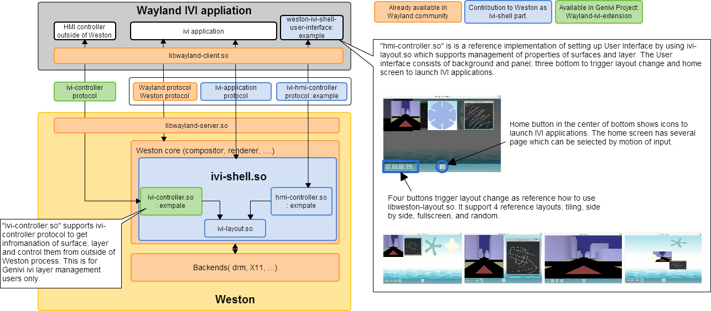

Weston IVI-shell
================

Weston's IVI-shell is a highly customizable shell targeted at use cases which
need custom control over the shell's window layout with one or more applications
without interactive configuration of the layout by the user.

Example use cases for the IVI-shell are IVI applications or industrial human
machine interfaces. In general, whenever the user interface requires the exact
positioning of multiple application surfaces on one or more screens.

The IVI-shell also provides a means for applications to identify themselves to
the shell by application IDs via the ivi_application Wayland protocol.

IVI-shell client protocol
-------------------------

Wayland clients can implement the ``ivi_application`` Wayland protocol, which
allows them to specify an ``ivi_id`` to allow the IVI controller to identify the
application. This allows the controller to implement special behavior for
well-known applications.

The IVI-shell is able to also handle clients that use the ``xdg-shell``
protocol, but in these cases the IVI-shell needs other means to identify client
applications.

See ``ivi-application.xml`` for the protocol specification.

IVI-shell Weston modules
------------------------

The IVI-shell consists of two main components: The ``ivi-shell.so`` and custom
IVI controller (with the ``hmi-controller.so`` example implementation).

The ``ivi-shell.so`` is responsible for handling the application IDs and for
providing abstractions to configure the window layout via the
``ivi_layout_interface``. This interface is discussed in `IVI-shell compositor
implementation`.

The IVI controller uses the ``ivi_layout_interface`` to implement a window
manager and is responsible for configuring the window layout, i.e. the position
of the applications on the screens.

Due to this separation, both modules must be loaded in your ``weston.ini`` to
use the IVI-shell.

.. code-block:: ini

  [core]
  shell=ivi-shell.so
  modules=hmi-controller.so

If you are using your custom controller, replace ``hmi-controller.so`` with the
name of your own controller module.

Controlling the IVI-shell
-------------------------

The IVI-shell provides the ``ivi_layout_interface`` API that a controller must
use to control the window layout of the IVI-shell. See
``ivi-shell/ivi-layout-export.h`` for the definition of this API.

For the initial configuration, the controller has to create at least one
``ivi_layout_layer`` and add the ``ivi_layout_layer`` to a ``weston_output``.
The layers allow to group multiple applications surfaces and control them
together and are the main mechanism to group and organize surfaces. These are
always necessary to show something using the IVI-shell. The IVI-shell will
internally create an ``ivi_layout_screen``, but a controller always uses the
``weston_output`` directly.

To get control over the client surfaces, the controller must use notifiers that
trigger whenever there are changes to the client surfaces.  The client surfaces
then show up as ``ivi_layout_surface``.  These have an ID, which allows the
controller to identify the surface and reconfigure the window layout
accordingly.

The controller must add the ``ivi_layout_surface`` to an ``ivi_layout_layer``
and configure it's position and z-order wrt. the other surfaces in the layer.
Otherwise, the newly added surface will not show up on the screen.

The IVI-shell will internally create an ``ivi_layout_view`` for each layer that
the surface was added to. However, the views are not provided to the IVI
controller.

After configuring all expected changes, the controller must call the
``commit_changes`` to atomically update the display layout.

IVI-shell example implementation
--------------------------------

The IVI-shell comes with an example implementation of an IVI controller -- the
`hmi-controller`. The hmi-controller will usually replaced by a custom
implementation that implements the use-case-specific behavior.

The hmi-controller is split into two parts:

The ``hmi-controller.so`` is a Weston Plugin that uses the
``ivi_layout_interface`` to perform the window manager tasks. It allows some
reconfiguration of the window layout via the ``ivi_hmi_controller`` protocol.
Other implementations may keep all window management inside the module or may
expose even more window management via a custom protocol to an external process.

The ``weston-ivi-shell-user-interface`` is an example hmi-controller helper
client that serves as a user interface for controlling the hmi-controller.

The hmi-controller can be customized using the ``[ivi-shell]`` section in the
``weston.ini``. An example configuration will be generated in
``<build_dir>/ivi-shell/weston.ini``.
