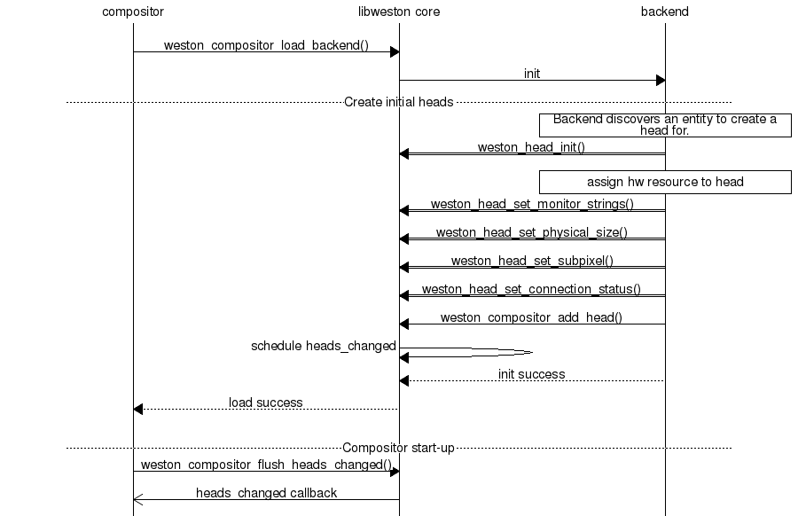
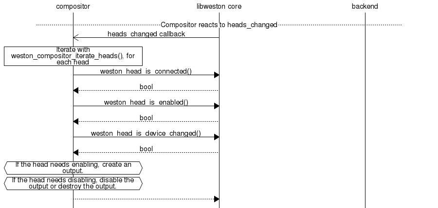
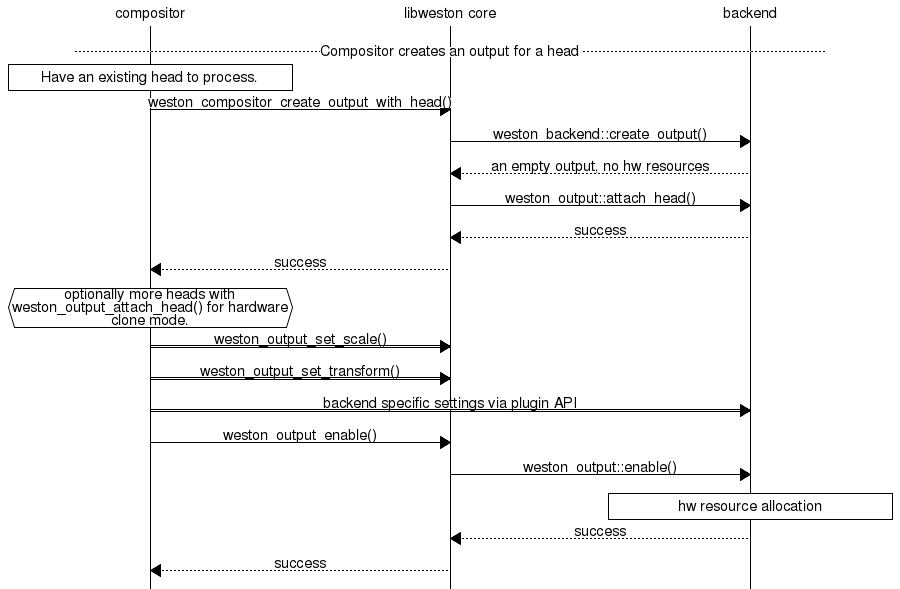
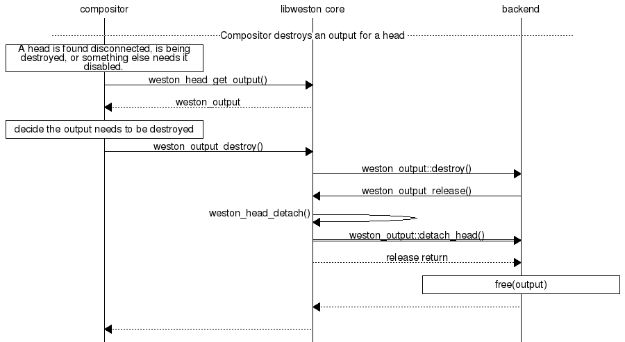
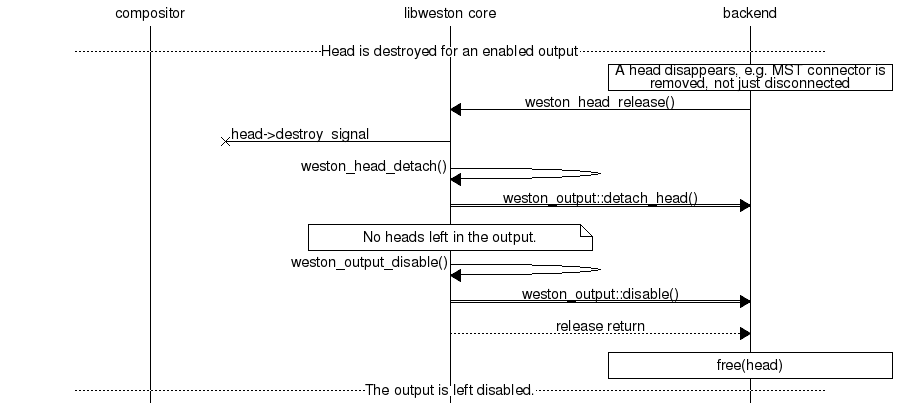

Output management
=================

Libweston output API revolves around two main concepts: :type:`weston_head` and
:type:`weston_output`. A head represents a connector or a monitor (a sink)
while an output represents the compositing state machine that produces content
(a source) to be presented on a head. If a backend allows it, it is possible to
attach more than one head to an output, in which case all those heads will have
identical timings and contents (they share framebuffers if applicable).

Heads are created and destroyed automatically by libweston according to e.g.
hardware features like the existence of physical connectors. Creation, hotplug
events and other changes to heads are notified with
:func:`weston_compositor_add_heads_changed_listener`. Head destruction is
communicated via :func:`weston_head_add_destroy_listener`. Note that
disconnecting a connector does not mean the head is destroyed. A head is
destroyed when the connector itself disappears.

Some backends, mainly virtual and nested ones, may offer backend-specific API
to create and destroy heads at will. In these cases a head does not represent
anything physical but can be e.g. a window in another window system.

Outputs are explicitly created and destroyed by the libweston user at will. To
make a new output or to light up a head, you create an output, attach the
head(s) to it, configure it, and finally :func:`weston_output_enable` it to
make it live.

An enabled output cannot be reconfigured, but this is intended to change in the
future. You can use :func:`weston_output_disable` to disable an output and then
reconfigure it, but this will cause visible glitches.

.. toctree::
   :caption: API

   head.rst
   output.rst

The following sequence diagrams show the function calls for various actions.
:numref:`libweston-initial-heads` shows how DRM-backend creates and configures
heads on compositor start-up.
:numref:`libweston-react-to-heads-changed` shows the principle of a compositor
reacting to initial heads discovered and hotplug events.

When a compositor wants to light up a monitor, it creates an output as in
:numref:`libweston-create-output`. Attaching more than one head to an output
requires specific hardware support in the case of DRM-backend. Other backends
are unlikely to support multiple heads per output.

A connector becoming disconnected is a common reason to destroy an output.
This happens in :numref:`libweston-destroy-output`.

Heads can also disappear. This is not due to normal monitor unplug but refers
to the connector itself disappearing. This is particularly possible with
DisplayPort Multi-Stream Transport, where unplugging a monitor will literally
remove a connector from the system as that connector was provided by the
monitor for daisy-chaining. One scenario of handling that is presented in
:numref:`libweston-head-destroyed`.

.. _libweston-initial-heads:

   Heads are being created on compositor start-up with a backend that manages
   head lifetimes completely on its own, e.g. DRM-backend.

.. _libweston-react-to-heads-changed:

   A compositor handles libweston notification of something with heads having
   changed. This happens on both compositor start-up and later due to hotplug.

.. _libweston-create-output:

   A compositor creates and configures an output for a head or heads it wants
   to light up.

.. _libweston-destroy-output:

   A compositor finds out a head has been disconnected and proceeds to
   destroy the corresponding output.

.. _libweston-head-destroyed:

   The backend realises that a piece of hardware has disappeared and needs to
   destroy the corresponding head. The head is released, and even when the
   compositor is not listening for head destroy signal, the output gets
   automatically disabled, though not destroyed.
