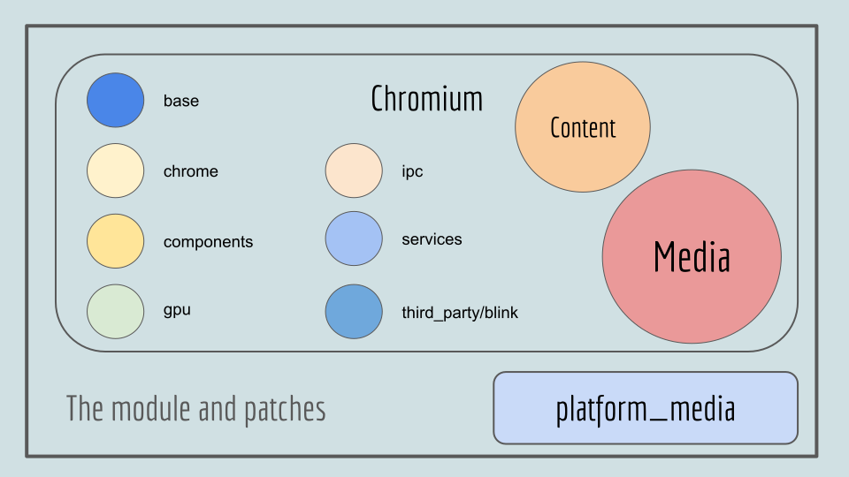

# Vivaldi Platform Media

## Introduction

Because of patents Vivaldi cannot ship with certain codecs turned on in ffmpeg (especially the AAC audio codec and the h264 video codec), so to still be able to play proprietary media we have two solutions:

* On Mac and Windows we use platform decoders in their SDKs (this is what the platform_media module does)
* On [**Linux**][7] we depend on the user installing another ffmpeg (extra)

## The Code

There are three parts to getting proprietary media to work in Vivaldi, the startup script (Linux), the platform_media module and the media patches

* Module : vivaldi/platform_media - see [**Module**][8]
* Three patches on vivaldi/chromium - see [**Patching**][9]
* Linux startup script - see [**Linux**][7]

## Media Entry Points

These are the entry points to media decoding, they are used in different circumstances, depending on which JavaScript API is in use and which platform it is running on. - see [**Entry Points**][3]

The media decoding is split into two groups

* Decoding is done in the gpu process - see [**Platform Media Pipeline**][4]
* Decoding is done in the renderer process - see [**Renderer Decoders**][13]

## The Rest of the Module Interface

* Ipc Mechanism : [**ProprietaryMediaGpuChannelManager**][1]
* [**Protocol Sniffer**][12] : Do some content sniffing to determine mime type
* Sandbox Warmup : How to allow the decoding inside the sandbx
* Feature Toggle : Simple file to hold ifdefs to turn on or off features
* Test code : Both tests and scaffolding for tests

## Subpages

* [**Gpu Channel Manager**][1] : Setting up the IPC channel and initializing the Gpu side
* [**CoreAudioDemuxer**][2] : Renderer Mac-only audio decoder
* [**Entry Points**][3] : Platform Media decoding APIs
* [**Platform Media Pipeline**][4]
* [**IPCAudioDecoder**][5] : Platform Media WebAudio backend
* [**IPCDemuxer**][6] : Platform Media container backend
* [**Linux ffmpeg**][7] : The Proprietary Media solution for Linux
* [**platform_media**][8] : Layout of the module
* [**Patching**][9] : The patches and the patch process
* [**Platform Media Pipeline**][10] : Platform implementation and the highlevel design of the pipeline
* [**Cross process protocol**][11] : The messages and their use-cases
* [**Sniffer**][12] : The content sniffing code
* [**Renderer decoders**][13] : Platform implementation and the highlevel design of the renderer decoders

[1]: docs/channel_manager.md
[2]: docs/core_audio_demuxer.md
[3]: docs/entry_points.md
[4]: docs/gpu_pipeline.md
[5]: docs/ipc_audio_decoder.md
[6]: docs/ipc_demuxer.md
[7]: docs/linux.md
[8]: docs/module.md
[9]: docs/patching.md
[10]: docs/pipeline_impl.md
[11]: docs/pipeline_protocol.md
[12]: docs/protocol_sniffer.md
[13]: docs/renderer_decoders.md