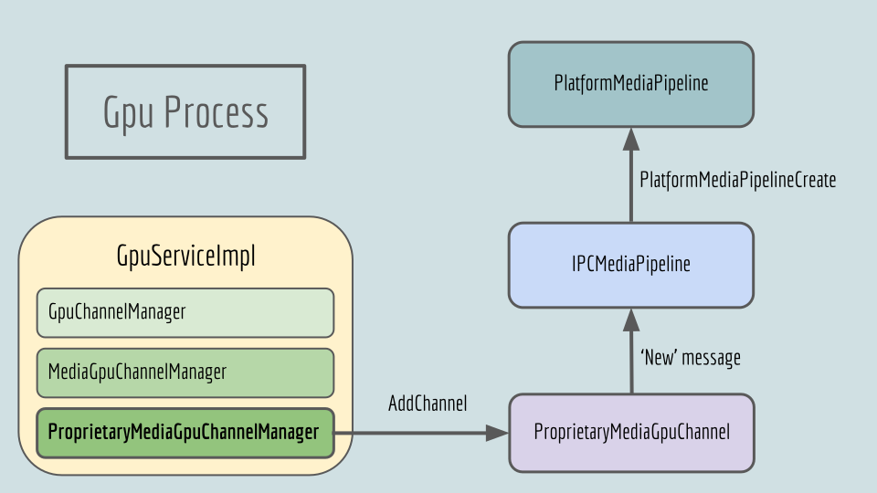

# IPC Channel Manager

## [**Back to top**](../README.md)

## ProprietaryMediaGpuChannelManager

Location: vivaldi/platform_media/gpu/pipeline/propmedia_gpu_channel_manager.h

To create the Proprietary Media IPC channel from the Renderer process to the Gpu process, there is a patch on GpuServiceImpl in Chromium. GpuServiceImpl has member called *media_gpu_channel_manager_* which Hardware Accelerated Media codepaths use, for example the Chromium GpuVideoDecoder. For proprietary media we have a similar member : *proprietary_media_gpu_channel_manager_*.

The ProprietaryMediaGpuChannelManager class and its associated ProprietaryMediaGpuChannel are defined inside of the platform_media module in the gpu directory. One ProprietaryMediaGpuChannel will be allocated for each [**Platform Media Pipeline**][1] that is created. The ProprietaryMediaGpuChannel will handle the *New* and *Destroy* messages, forwarding the rest to the appropriate [IPCMediaPipeline][2].

When it receives the *New* message it creates an [IPCMediaPipeline][2] and associates it with the route_id in the new message. IPCMediaPipeline is the Gpu side of the [**Platform Media Pipeline**][1].

## Message handling

In *GpuChannel::HandleMessageHelper* ([GpuChannel][3] in Chromium) unhandled messages first go to the *unhandled_message_listener_* then to *proprietary_media_message_listener_*, this change is a part of the [**Media Patches**][4]. The *proprietary_media_message_listener_* is an instance of the [ProprietaryMediaGpuChannel][5].

[1]: gpu_pipeline.md
[2]: ../gpu/pipeline/ipc_media_pipeline.h
[3]: ../../chromium/gpu/ipc/service/gpu_channel.cc
[4]: patching.md
[5]: ../gpu/pipeline/propmedia_gpu_channel.h