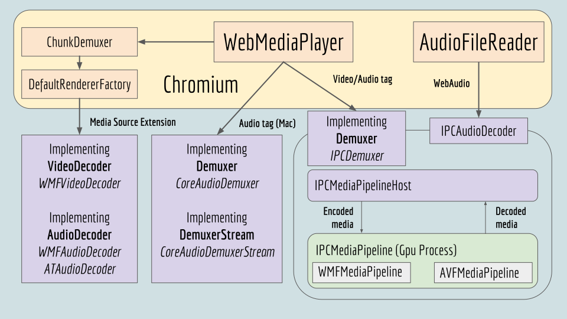

# Entry Points

## [**Back to top**](../README.md)

## High Level Overview

## Entry Point Classes

* [**IPCDemuxer**][1] (Demuxer, Cross platform)
* [**CoreAudioDemuxer**][2] (Demuxer, Mac)
* [**IPCAudioDecoder**][3]
* [**WMFAudioDecoder**][4] (AudioDecoder, Windows)
* [**ATAudioDecoder**][4] (AudioDecoder, Mac)
* [**WMFVideoDecoder**][4] (VideoDecoder, Windows)

NOTE: There is no VideoDecoder implementation for Mac, this is the cause of all of the “Blacklised Gpu” / “Old Mac” bugs. The reason for this is that normally the Chromium GpuVideoDecoder will decode h264 MSE video, however when the Gpu is blacklisted, this decoder cannot decode. In that case, on Windows, we will fall back to WMFVideoDecoder - on Mac there is no fallback.

## Implementing Chromium APIs

There are three APIs that are implemented in platform_media that fulfill decoding functionality: Demuxer, AudioDecoder and VideoDecoder.

These are really two different models, with the Demuxer there is a DataSource available that can be read from, so the actual decoders pull data from it, and the Demuxer pulls decoded media from the decoders. This is clearly a pull model. Throttling is achieved by not pulling.

However, the AudioDecoder and VideoDecoder follow a push model, here the caller pushes encoded buffers to the decoders and the decoders call back when decoded data is ready. Here throttling is done by not pushing more data. These are used by the ChunkDemuxer.

[1]: ipc_demuxer.md
[2]: core_audio_demuxer.md
[3]: ipc_audio_decoder.md
[4]: renderer_decoders.md