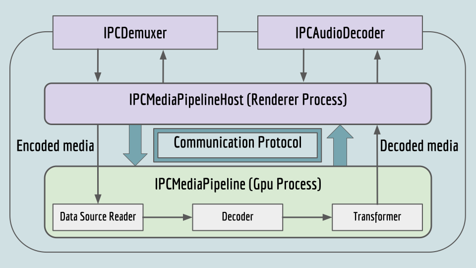

# The Platform Media Pipeline

## [**Back to top**](../README.md)

The majority of the files in platform_media form the Platform Media Pipeline. This pipeline consists of a renderer side and a gpu side and the communication between the two. The highlevel design is that encoded media is transferred to the gpu side using shared memory, on the gpu side it is decoded and finally the decoded media is transferred back.

There is a [**Pipeline Communication Protocol**][1] which has messages that fall into the following categories: Pipeline startup, Decoding media, Seeking in media and Pipeline shutdown

The [**Platform Implementation of the Pipeline**][2] follows a common design though the code for Windows and Mac is quite different.

[1]: pipeline_protocol.md
[2]: pipeline_impl.md