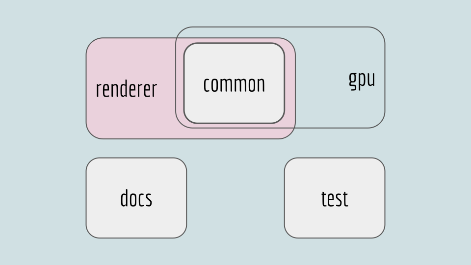

# The Platform Media Module

## [**Back to top**](../README.md)

Location : vivaldi/platform_media

## Directories

* renderer : Code that only runs in the renderer process
* common : Code that runs in both the renderer and the gpu process
* gpu : Code that only runs in the gpu process
* test : Tests and code used only in tests
* docs : Documentaion for the module

## Files

* OPERA_LICENSE.txt : The license file for Opera
* source_updates.gni : The file that controls how the module is compiled
* README.md : Top document in the documentation

## Subdirectory system

There are only a few types of subdirectories inside the module

* data_source : Implementation of a DataSource
* decoders : All the decoding code
* pipeline : Implementation of the pipeline
* win, mac, linux : Platform specific code [1]

[1] Why is there a ‘linux’ dir? To be able to build most of the module (the cross platform code) on Linux when doing the patch process (it’s faster)
