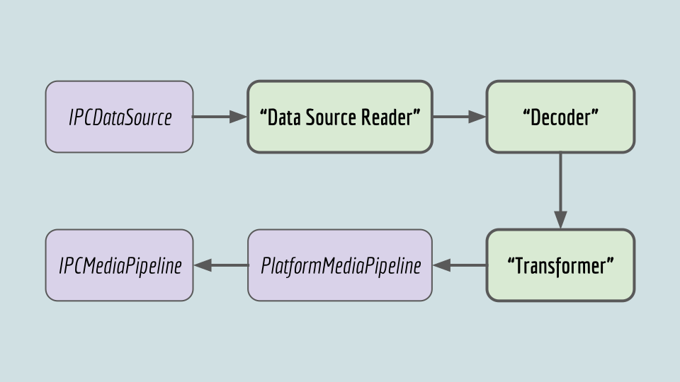

# Platform Implementation of the Pipeline

## [**Back to top**](../README.md)

## High Level Data Flow

The platform implementation of the Gpu side of the pipeline consists of implementing certain stages in the decode process. The ones in quotes are not actual class names, but define the function the platform has to fill.

1) __"Data Source Reader"__ : Something that wraps the IPCDataSource providing the platform SDK with a proper read interface for the raw encoded data
2) __"Decoder"__ : Something that uses the platform SDK to decode the data provided by the "Data Source Reader"
3) __"Transformer"__ : Something that converts the decoded data from the platfrom format to a uniform format to transport over to the renderer. Example: *PassThroughVideoDecoder* assumes YVU, so the order of the last two planes are switched on Mac (which produces YUV).
4) __PlatformMediaPipeline__ : A platform class that controls the decoding process, owning all the platform resources, including the "Data Source Reader", "Decoder" and "Transformer" functionality

## Mac Implementation

NOTE : There are 2 implementations of *PlatformMediaPipeline* on Mac : *AVFMediaPipeline* and *AVFMediaReaderRunner* (which is used it Mac version is at least 10.10)

### Macs __"Data Source Reader"__ implementation

To implement the __"Data Source Reader"__ functionality, the Mac code uses a workaround. The *DataSourceLoader* class implements the  [AVAssetResourceLoaderDelegate][1] API. This object can then be used to provide the data source for a AVURLAsset object. See especially this blog post [Implementing AVAssetResourceLoaderDelegate: a How-To Guide][2]

### Macs __"Decoder"__ implementation

### Macs __"Transformer"__ implementation

* **Video Transformer** : When the decoded video frame is placed in a DataBuffer in *AVFMediaDecoder::ReadFromVideoOutput* the last two planes are switched. The initial PlatformVideoConfig is created in [GetPlatformVideoConfig][3]. Config changes are not supported on Mac.
* **Audio Transformer** : When using AVPlayer the [AVFAudioTap][4] is used to extract the [AVAudioMix][5]. The DataBuffer is filled in ReadAudioSample in [AVFMediaReader][6].

## Windows Implementation

### Windows __"Data Source Reader"__ implementation

To implement the __"Data Source Reader"__ functionality, the Windows code contains an implementation of the [IMFByteStream][7]: *WMFByteStream*.

### Windows __"Decoder"__ implementation

### Windows __"Transformer"__ implementation

* **Video Transformer** : The initial PlatformVideoConfig is created in *WMFMediaPipeline::ThreadedImpl::GetVideoDecoderConfig* in [WMFMediaPipeline][8]. This function is also used on config changes. In *WMFMediaPipeline::ThreadedImpl::CreateDataBuffer* the DataBuffer is created and the metadata is set on it: timestamp and duration
* **Audio Transformer** : In *WMFMediaPipeline::ThreadedImpl::CreateDataBuffer* the DataBuffer is created and the metadata is set on it: timestamp and duration

## NOT FINISHED : Linux/GStreamer Implementation

**NOTE** : This is a very rough beginning, but it is probably useful if someone wants to look at this again. Saying it's 40% finished is being generous.

The idea here was to create a Linux platform backend that could be used if the extra-ffmpeg was not available. We have also discussed making this cross platform and have only one backend and manage the platform through GStreamer plugins.

The backend works (but is quite unstable) for video/audio tags. To work with MSE it would need to have a functional IPCVideoDecoder, see [**Renderer Decoders**][11], similarly for audio (on the branch below is the beginning of an IPCAudioDecoder(Adapter)).

[Chromium branch][9]
[Vivaldi branch][10]

[1]: https://developer.apple.com/documentation/avfoundation/avassetresourceloaderdelegate
[2]: http://blog.jaredsinclair.com/post/149892449150/implementing-avassetresourceloaderdelegate-a
[3]: ../common/mac/platform_media_pipeline_types_mac.mm
[4]: ../gpu/decoders/mac/avf_audio_tap.h
[5]: https://developer.apple.com/documentation/avfoundation/avaudiomix?changes=_4&language=objc
[6]: ../gpu/decoders/mac/avf_media_reader.mm
[7]: https://docs.microsoft.com/en-us/windows/desktop/api/mfobjects/nn-mfobjects-imfbytestream
[8]: ../gpu/pipeline/win/wmf_media_pipeline.cc
[9]: http://git.viv.int/?p=chromium/src.git;a=shortlog;h=refs/heads/vivaldi-upgrade/develop-work-3396-2018-05-29-gstreamer
[10]: http://git.viv.int/?p=vivaldi.git;a=shortlog;h=refs/heads/vivaldi-upgrade/develop-work-3396-2018-05-29-gstreamer
[11]: renderer_decoders.md