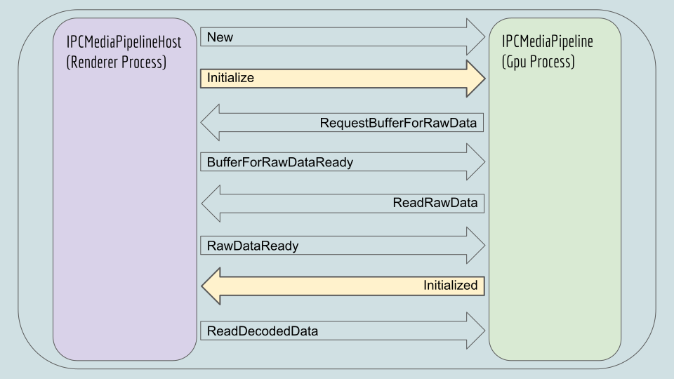
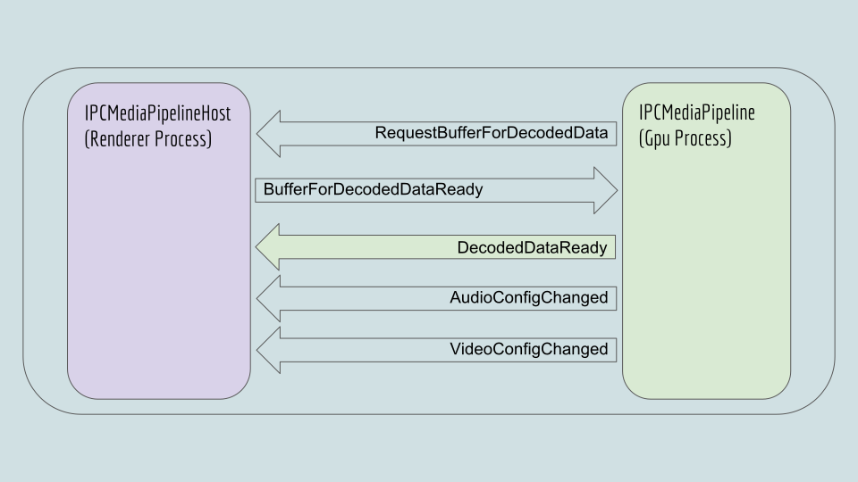
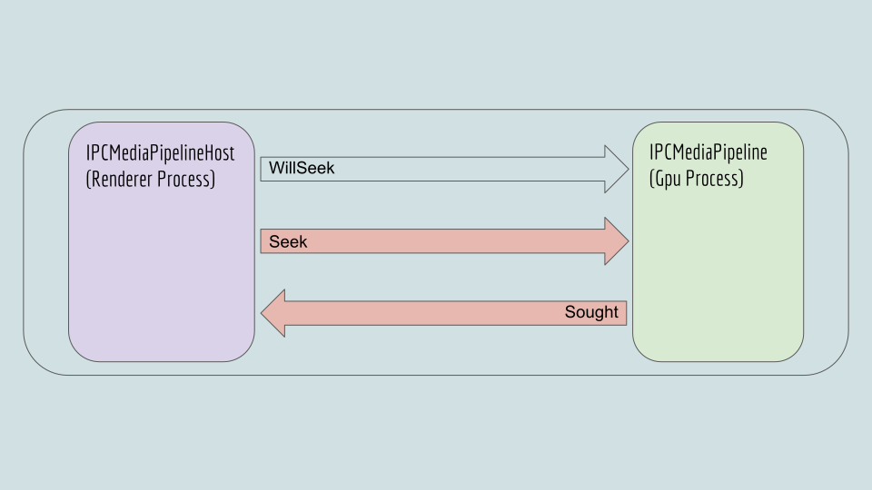
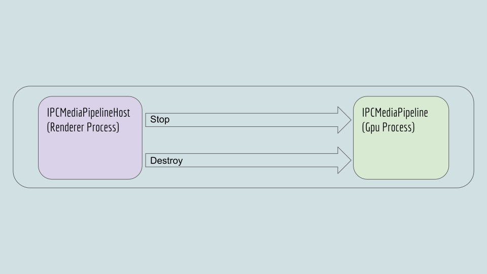

# Pipeline Communication Protocol

## [**Back to top**](../README.md)

Location: vivaldi/platform_media/common/media_pipeline_messages.h

The renderer and gpu side of the Platform Media Pipeline communicate over ipc with 18 different ipc messages. In the next slides the four different interactions are described:
* Pipeline startup
* Decoding media
* Seeking in media
* Pipeline shutdown

## Pipeline startup

There is a pipeline for each media stream that is played. The most complex interaction in this stage is the Initialize/Initialized exchange. In this stage the decoders will begin to decode the encoded raw data, a set of meta data is extracted and the decoder state is checked. Only when all of this is ready the Initialized message is passed back to the renderer. The renderer side will (if the Initialize was successful) start pulling video frames and/or audio buffers by sending ReadDecodedData. At this point the pipeline is running. What drives execution is the renderer side pulling data with ReadDecodedData. If the renderer side wants to “pause” it will just not pull decoded data. See [**IPC Channel Manager**][1] docs for the handling of the New message.

## Decoding media

## Seeking in media

## Pipeline shutdown

See [**IPC Channel Manager**][1] docs for the handling of the Destroy message.

[1]: channel_manager.md